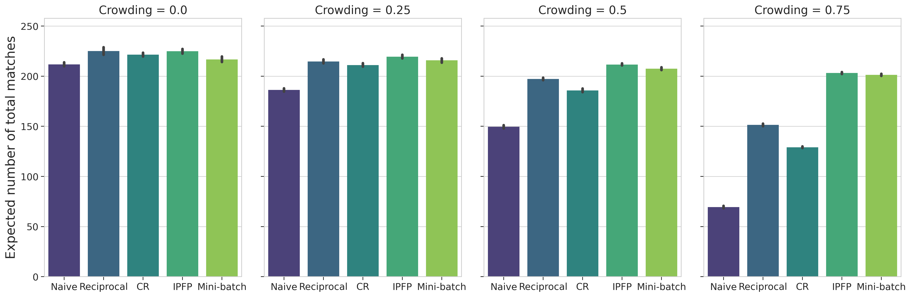
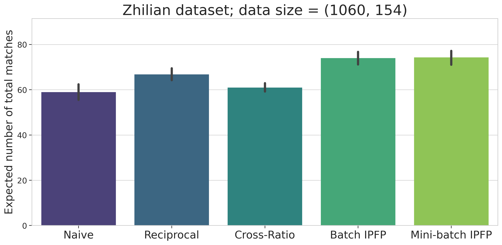
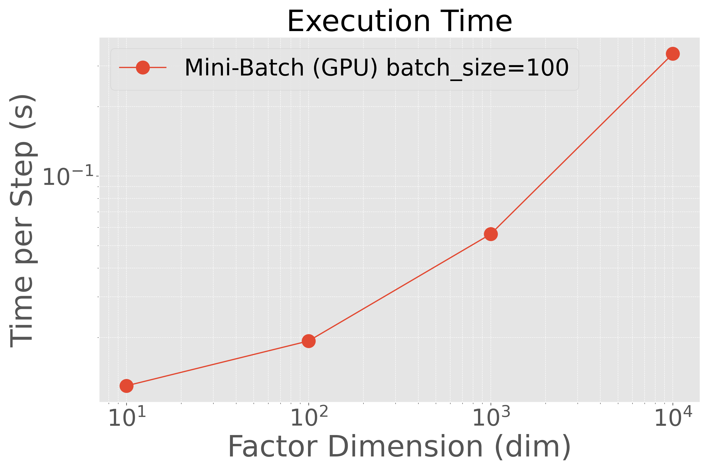
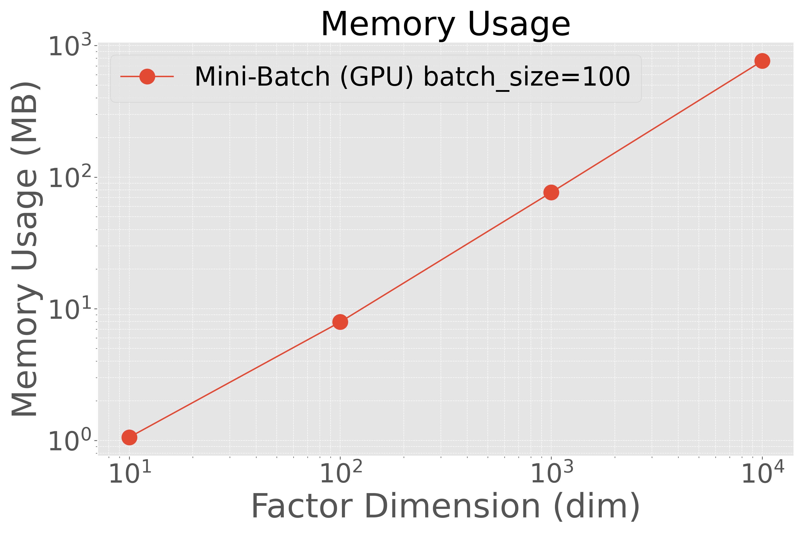

# Mini-Batch IPFP

This repository contains a tool for benchmarking various implementations of the Iterative Proportional Fitting Procedure (IPFP) algorithm within a Docker environment. We have encapsulated the dependencies and runtime into a Docker container to streamline the setup process. Currently, we support benchmarking using [ott-jax](https://github.com/ott-jax/ott).

**This software includes the work that is distributed in the Apache License 2.0.**

The following source codes are modified from original sources:
- `src/sinkhornIPFP.py` is modified from [ott-jax sinkhorn.py](https://github.com/ott-jax/ott/blob/main/src/ott/solvers/linear/sinkhorn.py)
- `src/geomIPFP.py` is modified from [ott-jax pointcloud.py](https://github.com/ott-jax/ott/blob/main/src/ott/geometry/pointcloud.py)

## Features

- Compare computation times across different IPFP implementations.
- Visualize the average computation time and memory usage with respect to input sizes.

## Prerequisites

- Docker (ensure your Docker can handle GPU workloads if you plan on utilizing GPUs)

## Usage

1. Clone this repository:
    ```bash
    git clone https://github.com/KNakadas/tumatching-sinkhorn.git
    cd tumatching-sinkhorn
    ```

2. Build the Docker image:
    ```bash
    docker build --no-cache -t tu-matching-gpu .
    ```

3. Run the container utilizing your GPU (ensure your Docker setup supports `--gpus` flag):
    ```bash
    docker run --gpus all -it --rm -v $HOME/tumatching-sinkhorn/:/workspace/ tu-matching-gpu /bin/bash
    ```

4. Inside the container, you can execute the main script:
    ```bash
    python src/run_exp1.py
    ```
    or
    ```bash
    python src/run_exp_minibatch.py
    ```


5. After running, view the generated plots to compare different IPFP methods. The plots will be stored in the mounted volume (specified by `-v` in the `docker run` command), and you can view them on your host machine.

## Notes

- The `-v` flag in the `docker run` command mounts a directory from your host system into the Docker container to ensure that logs or output files generated within the Docker environment are persisted and accessible even after the container is stopped or removed.
- The `--gpus all` flag allocates all available GPUs to your Docker container. Ensure that your Docker version and hardware support this feature. You might need to set up NVIDIA Docker runtime or make adjustments depending on your system configuration.

## Additional Results (in rebuttal comments)
 
- Results on the expected number of matches on synthetic dataset (to see that the algorithm is working correctly). The market size is 500 jobs and 750 candidates,
and the examination function is 𝑣(𝑘) = 1/exp(𝑘 − 1). The expected number of matches when following the IPFP-based recommendation policy (TU matching) increases with increasing crowding. In the case of mini-batch IPFP, the number of matches slightly decreases because the preference matrix is approximated using the product of factor vectors. Commands to reproduce this experiment are:
```bash
python src/compare_method.py
python src/compare_method.py --visualize
```


- Results on the [Zhilian Recruitment dataset](https://tianchi.aliyun.com/competition/entrance/231728/introduction). To ensure sufficient data for matrix factorization by ALS, we limited the dataset to users and jobs with at least 10 "satisfied" marks for jobs and 10 "delivered" for candidates. This refinement resulted in a reduction in the number of users from 4500 to 1060 and the number of jobs from 265825 to 154. For this experiment, preference matrices are reconstructed using the product of factor vectors obtained by ALS. Thus, In the case of mini-batch IPFP, the number of matches is almost the same as the number of matches obtained by the IPFP-based recommendation policy (cancelation of digits in calculation causes slight difference).
To reproduce results, you must read agreement statement on the datasets in the URL and download to your local `./data` directory.
Commands to reproduce this experiment are:
```bash
python src/compare_method.py --user_real_data --male_data_path ./data/path_to_dir/user_to_job --female_data_path ./data/path_to_dir/job_to_user
python src/compare_method.py --user_real_data --male_data_path ./data/path_to_dir/user_to_job --female_data_path ./data/path_to_dir/job_to_user --visualize
```


- Results on the computation time and memory efficiency of the algorithm on synthetic dataset with various dimensions of factor vectors. The increase in computation time and memory consumption of minibatch-IPFP has an almost linear relationship with the increase in the dimension of factor vectors.
Commands to reproduce this experiment are:
```bash
python src/run_exp_various_dims.py
```


